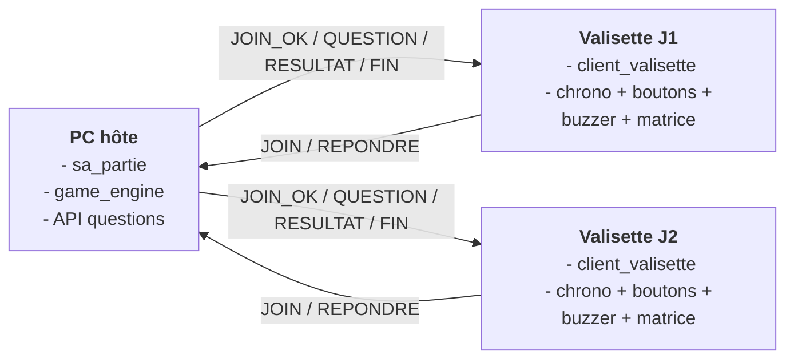
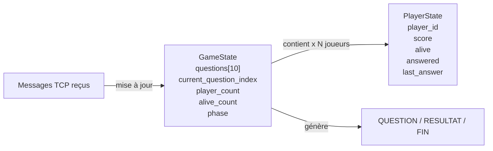

# Slide 3 — Protocole réseau et données partagées

## 1. Version slide prête à copier

**Titre**

`Protocole réseau et données partagées`

**Sous-titre**

`L’hôte garde la vérité du jeu, les valisettes affichent et répondent.`

**Texte minimal à laisser sur la slide**

- `TCP + texte clair + séparateur |`
- `JOIN / QUESTION / REPONDRE / RESULTAT / FIN`
- `État centralisé côté hôte`

**Exemple unique de trame**

```text
120|QUESTION|round=1|timer=15|...
```

## 2. Zone haute — schéma réseau

Objectif visuel :

- montrer que le **PC hôte** centralise la partie ;
- montrer que les **valisettes** communiquent avec lui ;
- montrer les **5 messages importants** sans afficher tout le protocole.



## 3. Zone basse — structures et partage de l’état

Objectif visuel :

- montrer que **GameState** est la source de vérité ;
- montrer que **PlayerState** décrit l’état métier de chaque joueur ;
- montrer que les messages reçus modifient l’état, puis que cet état sert à produire les messages suivants.



## 4. Ce qu’il faut dire visuellement sur la slide

- le **réseau transporte les informations**
- l’**état du jeu n’est pas partagé en mémoire**
- l’**hôte décide**, les **clients exécutent et remontent leur réponse**

## 5. Ce qu’il faut éviter sur la slide

- une liste complète de toutes les opcodes ;
- tous les champs de toutes les structures ;
- des extraits de code C ;
- un schéma unique trop chargé.

## 6. Références techniques du projet

- Protocole : [middleware_protocol.h](/home/oualid/Bureau/OCC/Projet/Projet-Objets-Connect-s-/Middleware/middleware_protocol.h)
- État du jeu : [game_engine.h](/home/oualid/Bureau/OCC/Projet/Projet-Objets-Connect-s-/game_engine/game_engine.h)
- Hôte réseau : [sa_partie.h](/home/oualid/Bureau/OCC/Projet/Projet-Objets-Connect-s-/sa_partie/sa_partie.h)
